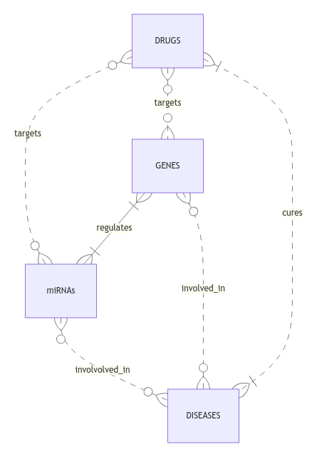

# Design Document

By Aja Bunta
Project Name: "Integrated Genomic and Therapeutic Database: Exploring miRNA-Gene-Disease-Drug Interactions"

[Video overview](https://www.youtube.com/watch?v=pbL5FiQk3ZE)

## Scope

The purpose of the database is to store and manage information related to genes, miRNAs, diseases, drugs, and their interactions. It's goal is to facilitate the representation and exploration of relationships between these biological entities and helping in the study of their interactions.

So in the database's scope there are:
* Genes with their name (symbol), entrez id, location of the gene (which chromosome), the predicted function of the genes (gene ontology) and the source, database, publication where we got this information
* miRNAs with their name, family, seed region, 5p and 3p accession, id of the target gen and location of that gene and the source of where we got this information
* Diseases, including the name and body system affected (for easier searches)
* Drugs, including name, type of drug (for example antibiotic), route of administration and miRNA, gene and disease from the first three tables
* Interactions, which includes id's of genes, miRNAs, diseases and drugs from the first 4 tables and then interaction type and miRNA, gene regulations
* miRNA-genes table user for many to many relationships between miRNAs and genes

Out of scope are elements like information about individuals or patients, detailed information about drugs and diseases and the information about how did the publication where we got the miRNA information, got there information (for example through laboratory research or bioinformatic computations).

## Functional Requirements

Users should be able to:

* Search for miRNAs targeting specific genes
* Search for genes associated with particular miRNAs
* Find genes associated with specific diseases
* Identify miRNAs associated with certain diseases
* Discover which drugs target specific genes
* Identify drugs associated with particular diseases
* Add new miRNAs, genes, diseases, or drugs to the database

The system does not support complex statistical analyses, for which they should use some visual representation programs, R studio or python.

## Representation

### Entities

The database includes the following entities:

#### Genes

The `genes` table includes:

* `id`, which specifies the unique ID for the gene as an `INTEGER`. This column thus has the `PRIMARY KEY` constraint applied.
* `name(symbol)`, which specifies the gene's name/symbol as `VARCHAR(50)`, even though usually the lenght of the gene symbol is lower. This column has the mandatory constraint (`NOT NULL`).
* `entrez_id`, specifies the gene's entrez id, which constist only of numbers and that's why an `INTEGER` is used. Since this id i very important and should also be unique, the `UNIQUE` and `NOT NULL`contraints are applied.
* `chromosome`, which specifies the gene's location. `VARCHAR(10)` is used to ensure that users are using abrevations (like 'chr19' instead of 'chromosome 19') for better visualization.
* `ontology`, which specifies GO annotations (function of the genes and gene products). Since one gene can have many predicted functions or gene products, the data type user is `TEXT`.
* `source`, which specifies the source (database, publication, authors) of the information that we provided with `INSERT` and `UPDATE` statements. The data type `TEXT` is used as this can be a long link or list of autors. There is also a `NOT NULL` constraint to ensure that users are correctly and consistently citing their information.

#### miRNAs:

The `miRNAs` table includes:

* `id`, which specifies the unique ID for the miRNA as an `INTEGER`. This column thus has the `PRIMARY KEY` constraint applied.
* `name`, which specifies the miRNA's name as `VARCHAR(30)`. This column has the mandatory constraint (`NOT NULL`).
* `family`, specifies the gene's entrez id, which constist only of numbers and that's why an `INTEGER` is used. Since this id i very important and should also be unique, the `UNIQUE` and `NOT NULL`contraints are applied.
* `seed`, which specifies the seed region of the mature miRNA as a `VARCHAR(30)`. `NOT NULL`contraint is applied.
* `5p_accession`, which specifies fixed identifier assigned to a sequence record of a miRNA as `VARCHAR(30)`.
* `3p_accession`, is the same as the column above, but the identifier is applied to 3p precursor. As in the column above `VARCHAR(30)` is used.
* `target_gene_id`, which is the ID of the gene from the 'genes' table as an `INTEGER`. This column thus has the `FOREIGN KEY` constraint applied, referencing the `id` column in the `genes` table to ensure data integrity.
* `chromosome`, which specifies the target gene's location. `VARCHAR(10)` is used (as in table 'genes' to ensure that users are using abrevations (like 'chr19' instead of 'chromosome 19').
* `source`, which specifies the source (database, publication, authors) of the information that we provided with `INSERT` and `UPDATE` statements. The data type `TEXT` is used as this can be a long link or list of autors. There is also a `NOT NULL` constraint to ensure that users are correctly and consistently citing their information.

#### Diseases

The `diseases` table includes:

* `id`, which specifies the unique ID for the disease as an `INTEGER`. This column thus has the `PRIMARY KEY` constraint applied.
* `name`, which specifies the disease name as `VARCHAR(100)`. This column has the mandatory constraint (`NOT NULL`).
* `affected_system`, includes system (or list of systems) which the disease affects (for example muscolosceletal system). The column is used to make the searches more user friendly, if users can't remember specific and correct name of the disease. Because it can be a list of systems (for example in systemic lupus erytomatosus) it is represented with `TEXT`.
* `description`, which includes short descriptions of the disease (for easier searches of interactions, if the user doesn't remember the name of the disease) and thus uses `TEXT` as data type.

#### Drugs

The `drugs` table includes:

* `id`, which specifies the unique ID for the drug as an `INTEGER`. This column thus has the `PRIMARY KEY` constraint applied.
* `name`, which specifies the drug name as `VARCHAR(100)`. This column has the mandatory constraint (`NOT NULL`).
* `type`, specifies the type of a drug for example antibiotic, analgesic, antihypertensive, as a `VARCHAR(50)`.
* `administration`, which specifies route of administration (for example oral, intravenous, intramusculus, topical, ...) as n `VARCHAR(50)`.
* `disease_id`, which is the ID of the disease from the 'diseases' table as an `INTEGER`. This column thus has the `FOREIGN KEY` constraint applied, referencing the `id` column in the `diseases` table to ensure data integrity.
* `target_gene_id`, which is the ID of the gene from the 'genes' table as an `INTEGER`. This column thus has the `FOREIGN KEY` constraint applied, referencing the `id` column in the `genes` table to ensure data integrity.
* `target_miRNA_id`, which is the ID of the miRNA from the 'miRNAs' table as an `INTEGER`. This column thus has the `FOREIGN KEY` constraint applied, referencing the `id` column in the `miRNAs` table to ensure data integrity.

#### Interactions

The `interactions` table includes:

* `id`, which specifies the unique ID for the interaction as an `INTEGER`. This column thus has the `PRIMARY KEY` constraint applied.
* `miRNA_id`, which is the ID of the miRNA from the 'miRNAs' table as an `INTEGER`. This column thus has the `FOREIGN KEY` constraint applied, referencing the `id` column in the `miRNAs` table to ensure data integrity.
* `gene_id`, which is the ID of the gene from the 'genes' table as an `INTEGER`. This column thus has the `FOREIGN KEY` constraint applied, referencing the `id` column in the `genes` table to ensure data integrity.
* `disease_id`, which is the ID of the disease from the 'diseases' table as an `INTEGER`. This column thus has the `FOREIGN KEY` constraint applied, referencing the `id` column in the `diseases` table to ensure data integrity.
* `drug_id`, which is the ID of the drug from the 'drugs' table as an `INTEGER`. This column thus has the `FOREIGN KEY` constraint applied, referencing the `id` column in the `drugs` table to ensure data integrity.
* `type`, specifies the type of a interaction for example activation or inhibition as a `VARCHAR(50)`.
* `miRNA_regulation`, specifies how miRNA is regulated in the disease, because of a drug (up-regulated, down-regulated or normal) as a `VARCHAR(20)`.
* `gene_regulation`, specifies how gene is regulated in the disease ot because of a drug as a `VARCHAR(20)`.

#### miRNAs - genes

The `miRNAs_genes` table includes:

* `id`, which specifies the unique ID for the interaction between miRNAs and genes as an `INTEGER`. This column thus has the `PRIMARY KEY` constraint applied.
* `miRNA_id`, which is the ID of the miRNA from the 'miRNAs' table as an `INTEGER`. This column thus has the `FOREIGN KEY` constraint applied, referencing the `id` column in the `miRNAs` table to ensure data integrity.
* `gene_id`, which is the ID of the gene from the 'genes' table as an `INTEGER`. This column thus has the `FOREIGN KEY` constraint applied, referencing the `id` column in the `genes` table to ensure data integrity.

### Relationships

The below entity relationship diagram describes the relationships among the entities in the database.

As detailed by the diagram:

* A miRNA can influence the expression of 1 to many genes, and simultaneously, a gene can be influenced by 1 to many miRNAs, establishing a many-to-many relationship between miRNAs and genes.
* miRNAs and genes can be associated with 0 to many diseases, and a disease can be linked to 0 or many miRNAs and genes, allowing for diverse relationships.
* Drugs have the potential to treat one or more diseases, and diseases must have at least one corresponding cure. This enforces a relationship where drugs cure diseases, ensuring a minimum and flexible connection.
* Drugs can target 0 to many genes and 0 to many miRNAs. Conversely, miRNAs and genes can be associated with 0 or more drugs, allowing for various potential connections between drugs and genetic elements.

## Optimizations

Per the typical queries in `queries.sql`, it is common for users of the database to access all information based on gene name, miRNA name or disease name. For that reason, indexes are created on the `genes.name`, `miRNAs.name`, and `diseases.name` columns to speed those kind of searches. Because queries are gonna be a lot more common then inserting or updating new data, this indexes will not lower the performance for regular users.

To optimize query performance on many to many relationships between genes and miRNAs (which will be the case most of the time) a special associative table `miRNAs_genes` is introduced.

## Limitations

* The database might not support complex statistical analyses or advanced data mining directly. Users might need to export data for such purposes and then analyse the data in R studio or similar programs.
* Big limitation is updating of the tables. For this database to be of good use, first it needs to be filled with all the already known information (from multiple other databases avaliable online) and then it needs to be updated regulary to provide real-time clinical data. For that reason regular updates or synchronization processes are absolutelly required.
* Hand in hand with real-time data goes the completeness of the database, which relies on available data sources, and gaps may exist.
* The database is also not capable to store disease - disease interactions or drug - drug interactions.
